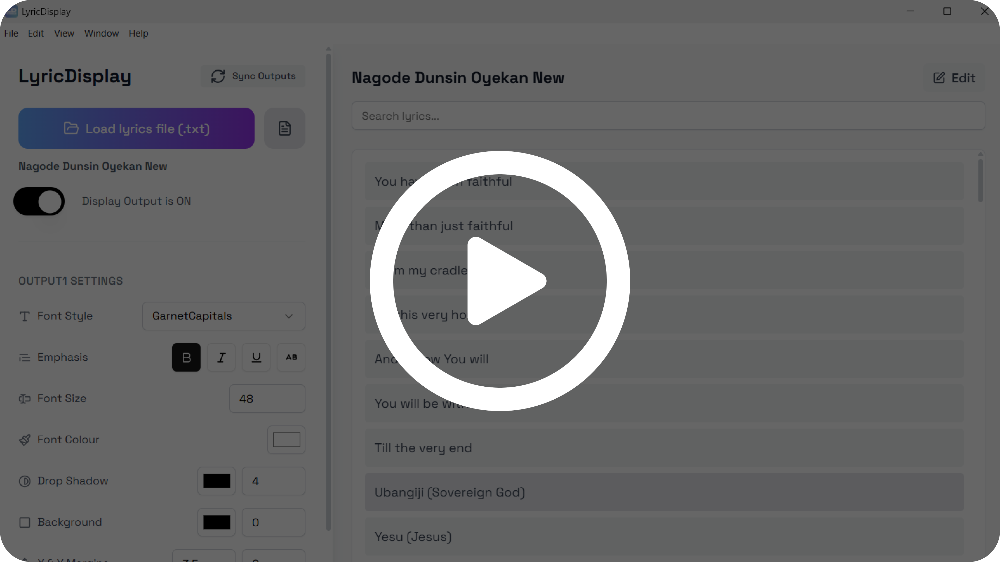

# LyricDisplay Releases

> Official release repository for **LyricDisplay** — a professional real‑time lyric display app for live events, church services, and broadcasts.

**Maintained by:** Peter Alakembi

---

## Quick links

* **Latest release:** [https://github.com/PeterAlaks/lyric-display-updates/releases/latest](https://github.com/PeterAlaks/lyric-display-updates/releases/latest)
* **All releases:** [https://github.com/PeterAlaks/lyric-display-updates/releases](https://github.com/PeterAlaks/lyric-display-updates/releases)
* **Main app repo:** [https://github.com/PeterAlaks/lyric-display-app](https://github.com/PeterAlaks/lyric-display-app)

---

## Downloads

Grab the installer for your platform from the **Latest release** page:

* **Windows** – `.exe`
* **macOS** – `.dmg` (Coming soon)
* **Linux** – `.AppImage` (or other artefacts provided per release) (Coming soon)

> Builds are packaged for one‑click install. No CLI required.

---

## Install & update

1. Download the installer for your OS from the **Latest release**.
2. Run the installer and launch **LyricDisplay**.
3. **Auto‑updates:** the app checks this releases repo for updates and will prompt you to install when a new version is available.

**Uninstall / reinstall:** Installing a newer version over an existing one is supported; your settings are preserved.

---

## How to use

Once installed, you can start using LyricDisplay right away.

### 1. Launch the app

* After installation, open **LyricDisplay** from your desktop or applications folder.
* The control panel will appear where you can load lyrics and configure outputs.

### 2. OBS/VMix integration (same system)

* In OBS or VMix, add a **Browser Source** input.
* For **Output 1**, set the URL to `http://localhost:4000/#/output1`.
* For **Output 2**, set the URL to `http://localhost:4000/#/output2`.
* Set the width and height of the browser source to match your video canvas (e.g. 1920 x 1080).
* Enable **Shutdown source when not visible** for performance and **Refresh browser when active** for reliability.

### 3. OBS/VMix integration (across the network)

If you want to capture outputs from another PC on the same LAN:

⚠️ **Important:** All systems (the machine running LyricDisplay and the OBS/VMix machine) must be connected to the **same network** via LAN cable or Wi‑Fi.

1. **Assign a static IP** to the machine running LyricDisplay:

   * **Windows:**

     * Open *Control Panel → Network & Internet → Network and Sharing Center → Change adapter settings*.
     * Right‑click your active adapter → *Properties* → select *Internet Protocol Version 4 (TCP/IPv4)* → *Properties*.
     * Choose *Use the following IP address* and assign a fixed address (e.g. `192.168.1.100`).
   * **macOS:**

     * Go to *System Preferences → Network*.
     * Select your active interface (Wi‑Fi or Ethernet) → *Advanced* → *TCP/IP*.
     * Set *Configure IPv4* to *Manually* and enter a static address (e.g. `192.168.1.101`).

2. On the OBS/VMix machine, add a **Browser Source** with the following URLs:

   * `http://<Static-IP>:4000/#/output1`
   * `http://<Static-IP>:4000/#/output2`

   Replace `<Static-IP>` with the fixed IP you configured.

### 4. Load lyrics

* Use **File → Load Lyrics File** (or `Ctrl/Cmd + O`).
* Drag and drop `.txt` files directly into the app.
* Create a new song from scratch with **File → New Song** (`Ctrl/Cmd + N`).

### 5. Manage outputs

* Configure **Output 1** and **Output 2** independently in the settings panel.
* Preview outputs with `Ctrl/Cmd + 1` or `Ctrl/Cmd + 2`.
* Toggle the **Display Output** switch to show or hide lyrics on screen.

### 6. Operate live

* Click any lyric line to send it instantly to the output windows.
* Use the search bar to quickly find a song or line.
* Navigate results with **Shift + Up/Down**.
* Refresh or resync outputs if styling changes don’t appear immediately.

## How to Use — Video Guide

For a step-by-step demonstration, click on the video below to watch the included guide (Opens in Google Drive):

<p align="left">
  <a href="https://drive.google.com/file/d/1fP4fSSWSNvSocI8fK7hktdJ7dY6xnCM-/view?usp=sharing">
    
  </a>
</p>

This video walks through launching the app, loading lyrics, etc.

---

## Highlights (what you’re getting)

* **Dual independent outputs** with transparent backgrounds (ideal for OBS/VMIX browser sources)
* **Advanced lyric management** with grouped translations and live editing
* **Comprehensive styling** (fonts, colours, shadows, margins, themes)
* **Cross‑platform** with keyboard‑driven workflow and dark mode

> Full feature list and user guide live in the **main app repo** docs.

---

## System requirements (recommended)

* **Windows:** 10 or 11 (64‑bit)
* **macOS:** 12 Monterey or newer (Apple Silicon & Intel)
* **Linux:** Modern 64‑bit distro with glibc ≥ 2.28
* **Hardware:** 8 GB RAM, dual‑display capable GPU for output windows

---

## Verify your download (optional)

Where provided, compare the file’s checksum against the published hash on the release page. On Windows PowerShell:

```powershell
Get-FileHash .\LyricDisplay-Setup-2.1.1.exe -Algorithm SHA256
```

---

## Troubleshooting

* **Output windows not showing in OBS/VMIX:** Refresh/reload the Browser Source; ensure the app is running on the same machine or reachable host.
* **No updates found:** Check your internet connection; confirm you’re running a release build (not a local dev build).
* **Styling not applying:** Use the in‑app "Sync Outputs" control; then refresh your Browser Source in your live software.

See the **main app repo** for deeper troubleshooting guides and FAQs.

---

## Changelog

For detailed changes, use the per‑release notes on the **Releases** page. The high‑level latest:

---

## Support

* **Installation or release issues:** open an issue in this releases repo.
* **Feature requests & development issues:** use the **main app repo** issue tracker.

Contact: Peter Alakembi — [https://linktr.ee/peteralaks](https://linktr.ee/peteralaks)

---

## Licence & credits

## Lyrics Provider Credits & Copyright Disclaimer

LyricDisplay integrates optional online lyrics search features powered by free and publicly available lyrics providers.  
All lyrics, metadata, and related content displayed through these services remain the property of their respective copyright holders.

### Integrated Providers
- **Lyrics.ovh** — Free lyrics API (public domain and licensed material) provided for educational and non-commercial use.  
- **Vagalume** — © Vagalume Media Group. Lyrics and artist data are provided through the official Vagalume API.  
- **Hymnary.org** — © Hymnary.org / Christian Classics Ethereal Library (CCEL). Content is provided for educational and liturgical purposes.  
- **Open Hymnal Project** — Public domain hymn texts and music as compiled by the Open Hymnal Project.

### Logos & Trademarks
Logos and brand marks of the above providers are displayed in LyricDisplay **for identification and attribution purposes only**.  
All trademarks, service marks, and logos are the property of their respective owners.  
Their inclusion does **not imply endorsement, partnership, or affiliation** with LyricDisplay or its developers.

### Usage Notice
- LyricDisplay does **not store**, redistribute, or claim ownership of any lyrics obtained through these sources.  
- Lyrics are fetched on demand from publicly accessible APIs and displayed **solely for personal, church, and non-commercial use**.  
- If you are a copyright holder and wish to request content removal or modification, please contact the original provider directly.

> **Disclaimer:** LyricDisplay and its developers are not affiliated with or endorsed by any of the above content providers.  
> This feature is offered “as is” for convenience and educational purposes only.


© 2025 Peter Alakembi. All rights reserved.

**Developers**
Peter Alakembi (Lead Designer & Developer)
David Okaliwe (Co‑Developer)

---

*LyricDisplay — Powering worship experiences worldwide.*
